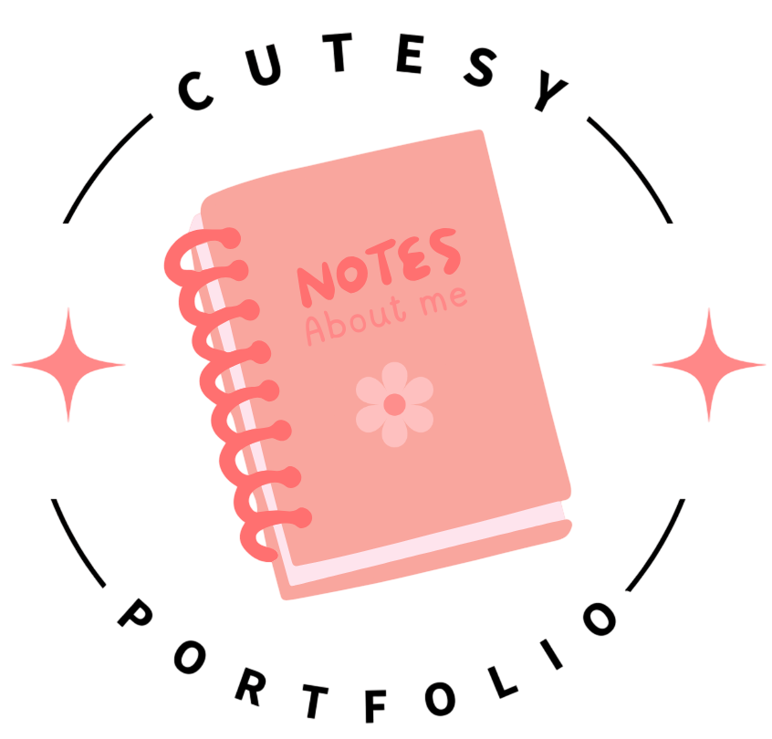
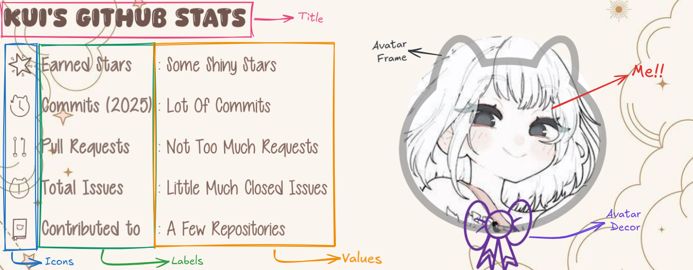

<p align="center"></p>
<h4 align="center">💞 Prettify your portfolio with stylish designs powered by a <a href="gleam.run">glimling</a> backend on <a href="fly.io">fly.io</a>!!</h4>
<p align="center">
  <a href="#-key-features">Key Features</a> •
  <a href="#-how-to-use">How To Use</a> •
  <a href="#-deploy-yourself">Deploy Yourself</a> •
  <a href="#-credits">Credits</a>
</p>

## 🍓 Key Features

* ୨ৎ Cute Design!!
  - I will continue to draw more icons (˶ᵔᵕᵔ˶)
* ୨ৎ Font Options
  - There is lot of *(not too much)* fonts you can see them on [credits](#credits) section 𖹭.ᐟ
* ୨ৎ Custom Color Schema
  - You are the artist you have the palette, **every color** can be **modified**!! (˵•̀ᴗ-˵) ✧
* ୨ৎ Background Options
  - There's not solid colors but there is **images**!! (๑>◡<๑)
* ୨ৎ Layout Options
  - You can **decide** how the image will be displayed!! ₊˚⊹ᰔ

## 🌷 How To Use??

### 💄 GitHub Stats

To make Cutesy Portfolio generate a **GitHub Stats image** follow this!! (づ>v<)づ♡
```md

```
And that's it, all ready!! See, super **easy** right?? (๑ᵔ⤙ᵔ๑) But let's say you want to **customize**, it's okie no problem!!



Here's the some **parts** of the generated image!!
You can **control** them by changing the URL, let's say you want to change the **title color**,
color of the title can be controlled by `tcolor` parameter, if you want to make it pink just do...
```md

```
And it will work as you wish, hex colors are also acceptable!! ૮˶ᵔᵕᵔ˶ა

> ⋆｡‧˚ʚ Note for sillies ɞ˚‧｡⋆ \
>   When you want to add multiple parameters you need to add '&' between them!! \
>   Just like ?tcolor=pink&icolor=rebeccapurple

**ALSO!!** I prepared a table to show which parameter controls which part!! (*ᴗ͈ˬᴗ͈)ꕤ*.ﾟ

| Part         | Param  | Default        | Options                   |
|--------------|--------|----------------|---------------------------|
| Template     | tmplt  | qiwq           | qiwq, piwp                |
| Background   | bg     | spacy          | spacy                     |
| Avatar Decor | decor  | ribbon         | ribbon                    |
| Avatar Frame | frame  | kitty          | kitty                     |
| Title Font   | tfont  | copy-duck      | copy-duck, cutie-patootie |
| Content Font | cfont  | cutie-patootie | copy-duck, cutie-patootie |
| Icon Pack    | icon   | kitten         | kitten                    |
| Title Color  | tcolor | #70564e        | (any css color)           |
| Icon Color   | icolor | #70564e        | (any css color)           |
| Label Color  | lcolor | #8a746c        | (any css color            |
| Value Color  | vcolor | #806258        | (any css color)           |
| Frame Color  | fcolor | gray           | (any css color)           |
| Decor Color  | dcolor | rebeccapurple  | (any css color)           |
| Decor Pose X | dposeX | 25%            | (any css unit thingy)     |
| Decor Pose Y | dposeY | 80%            | (any css unit thingy)     |

---

### 🍭 Skill Icons

To display icons for showcasing your skills you can do it like...
```md

```
For now there is not too much options to customize the icons,
if you are not happy with this, there is a wonderful project i know!!
[Skill Icons](https://github.com/tandpfun/skill-icons) has lot of icons and there is more customization options!! ⸜(｡˃ ᵕ ˂ )⸝♡

Ah and here's the aviable icons!!
| Icon ID     | Icon                                                                     |
|-------------|--------------------------------------------------------------------------|
| `css`       |       |
| `haskeell`  |   |
| `html`      |      |
| `java`      |      |
| `js`        |        |
| `php`       |       |
| `python`    |    |
| `react`     |     |
| `ruby`      |      |
| `scala`     |     |
| `selenium`  |  |
| `svelte`    |    |
| `swift`     |     |

---

## 🍰 Deploy Yourself

### 🎀 Prerequisites

There is some **required softwares** to run Winkie!! Before you begin, **make sure** you have installed the following softwares!! \
**[Gleam](https://gleam.run/getting-started/installing/) • [Git](https://git-scm.com/downloads) • [Docker](https://docs.docker.com/get-started/get-docker)**

### 💞 Clone and prepare

You will install all the files of Cutesy Portfolio in to your machine from **GitHub**!! **⸜(｡ > ᵕ < )⸝♡**
```sh
$ git clone https://github.com/lovely-kui/cutesy-portfolio.git && cd cutesy-portfolio
```

### 🌷 Set Environment

There is an environment file to store **sensitive** datas!!
Edit the **.env.example** file to match your setup,
for example you need to put your GitHub's personal access token in there!! **( ˶ˆ꒳ˆ˵ )**

You don't know how to get your tokens?? There is a [documentation](https://docs.github.com/en/authentication/keeping-your-account-and-data-secure/managing-your-personal-access-tokens#creating-a-personal-access-token-classic) for that!!

> **⋆｡‧˚ʚ Note for sillies ɞ˚‧｡⋆** \
> Don't forget to change **.env.example** file's name to **.env** when you are done!!

### 💖 Run

You can run the project by `docker-compose up --build` command, when it's ready visit the "http://127.0.0.1:8000" on your browser!!
I don't think i need to explain all the details just know that Cutesy Portfolio uses [Redis](https://redis.io/) as a cache!!
So if you are not running Redis locally, process will crash when `gleam run` used instead, that's why we need that lovely whale!! 🐳

Also [here's](https://gleam.run/deployment/fly/) how to host the project on cloud!! (⸝⸝๑﹏๑⸝⸝)

## 🍬 Credits

### 🧸 Fonts
* **Copy Duck** by [Khurasan](https://fontbundles.net/khurasan)
* **Cutie Patootie** by [Vanessa Bays](http://bythebutterfly.com)

### 🍡 Assets

* **Skill Icons** by [Icons8](https://icons8.com/icons/set/logos--style-dusk)
* **Spacy Background** by... I don't know who is the artist i found it on Pinterest (╥‸╥)

### 🍥 Ideas
* **Skill Icons** by [Thijs](https://github.com/tandpfun)
* **GitHub Stats** by [Anurag Hazra](https://github.com/anuraghazra)
